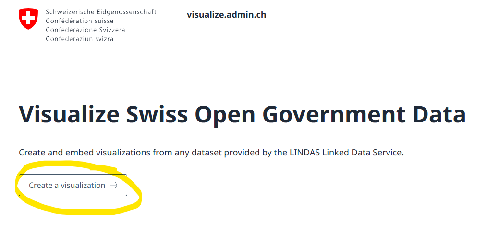
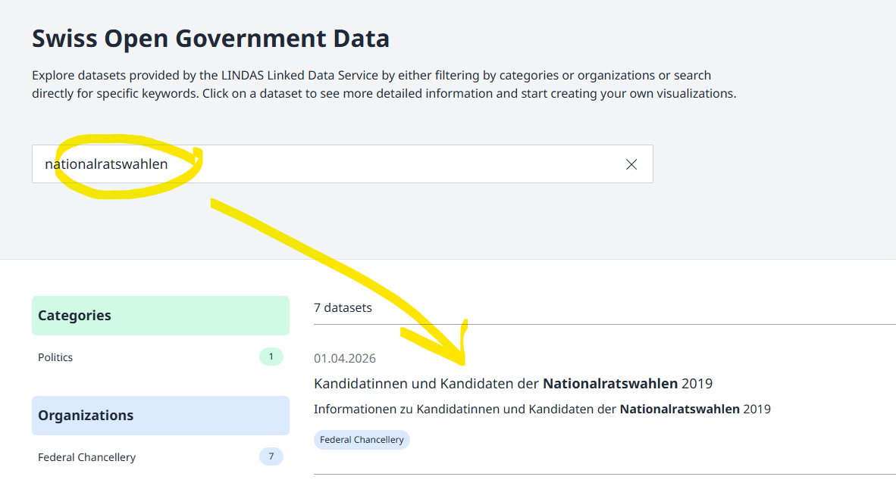
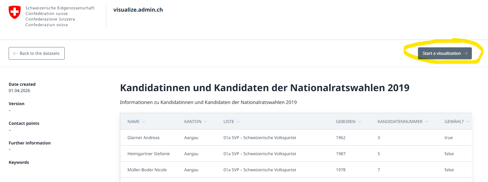
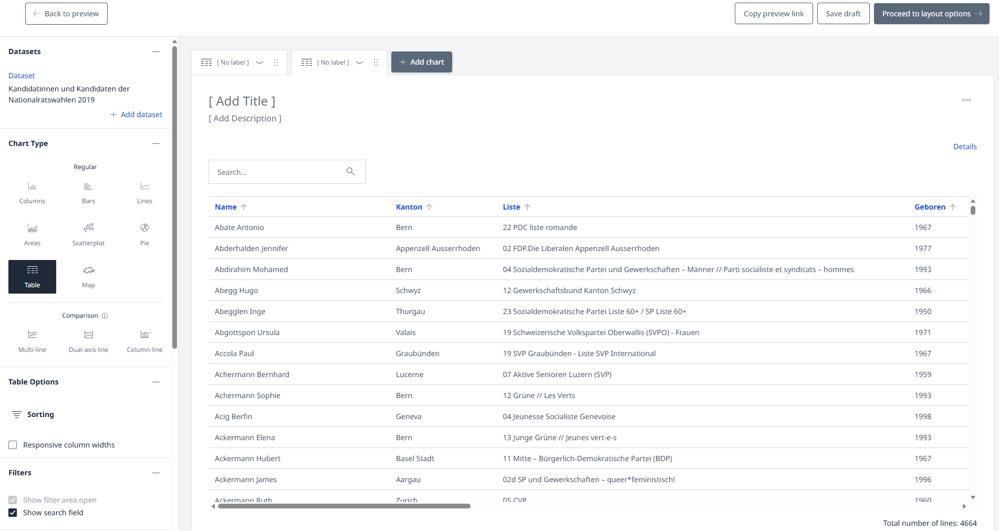
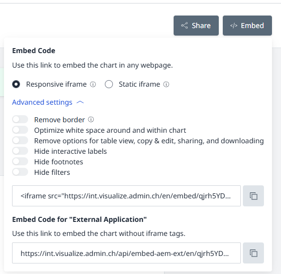

# fch-cube
A set of .NET components creating cube.link conform datasets.

This repository gives an overview on the different components to publish cube.link conform datasets.

* [FCh.Cube.Dimension](https://github.com/swiss/fch-cube-dimension)
* [FCh.Cube.Rawdata](https://github.com/swiss/fch-cube-rawdata)

Both libraries are based on https://github.com/dotnetrdf/dotnetrdf

Register your namespaces on the graph.
```csharp
var graph = new Graph();
graph.NamespaceMap.AddNamespace("ex", new Uri("https://example.com/"));
```

# Libraries

## FCh.Cube.Dimension
This library supports the creation of "dimensions" (see: https://cube.link/#dimensions-0).

### Usage
#### Install NuGet Package
`dotnet add package FCh.Cube.Dimension`

#### Dependency Injection
Register the library's services using the extension method on `IServiceCollection`.

```csharp
var builder = WebApplication.CreateBuilder(args);
builder.Services.AddDimesionService();
```

Then inject `Swiss.FCh.Cube.Dimension.Contract.IDimensionService` into your class.

#### Create a Dimension
First, create your dimension entries using `Swiss.FCh.Cube.Dimension.Model.DimensionItem`.
Provide a key, a name and (if needed) additional properties.

```csharp
new DimensionItem(
	person.Id,
	new LingualLiteral($"{person.Surname} {person.GivenName}", "en"),
	[
		new AdditionalLingualProperty("schema:givenName", new LingualLiteral(person.GivenName)),
		new AdditionalLingualProperty("schema:familyName", new LingualLiteral(person.Surname))
	]);
```

Finally, use the `IDimensionService` to create the triples defining your dimension.

```csharp
var personTriples =
	_dimensionService.CreateDimension(
		personDimensionItems,
		graph,
		"ex:person",
		[new LingualLiteral("Name your dimension here", "en")],
		rdfTypes: ["http://schema.org/Person"]);
```

*Note:* `FCh.Cube.Dimension` will not push the triples triples to an RDF store. This has to be done using `dotnetRdf`. See https://dotnetrdf.org/docs/3.4.x/user_guide/writing_rdf.html for more information about `dotnetRdf`.

## FCh.Cube.RawData
This library supports the creation of observations (https://cube.link/#Observation) building up your cube.
These observations can link to previously created dimensions values.

### Usage

#### Install NuGet Package
`dotnet add package FCh.Cube.RawData`

#### Dependency Injection
Register the library's services using the extension method on `IServiceCollection`.

```csharp
var builder = WebApplication.CreateBuilder(args);
builder.Services.AddCubeRawData();
```

Then inject `Swiss.FCh.Cube.RawData.Contract.ICubeRawDataService` into your class.

#### Create Raw Data
A new data row can be created using `Swiss.FCh.Cube.RawData.Model.ObservationDataRow`.

```csharp
var dataRow = new ObservationDataRow
{
	KeyUri = "ex:myObservation/459",
	ValidFrom = new DateTime(2000, 1, 1),
	ValidTo = new DateTime(2025, 12, 31)
};
```

Links to dimension value can be added like this.

```csharp
dataRow.KeyDimensionLinks.Add(new KeyDimensionLink { PredicateUri = "ex:hasSomeDimension", Uri = "ex:dimension/2354" });
```

Additionally, raw values can be added as well.

```csharp
dataRow.Values.Add(new DimensionValue { Predicate = "schema:description", Value = "some text", LanguageTag = "en" });
```

Finally, the data can be transformed to triples using the ```ICubeRawDataService```.

```csharp
var rawDataTriples =
	_cubeRawDataService.CreateTriples(
		graph,
		"ex:myCube",
		"ex:myCube/observationSet",
		new List<ObservationDataRow> {});
```

*Note:* `FCh.Cube.RawData` will not push the triples triples to an RDF store. This has to be done using `dotnetRdf`. See https://dotnetrdf.org/docs/3.4.x/user_guide/writing_rdf.html for more information about `dotnetRdf`.

# Visualization

## Using visualize.admin.ch
The data in "cube-form" can be visualized using [visualize.admin.ch](https://visualize.admin.ch).
Visualize can read the cube data and offers editors to create all sorts of diagrams, such as tables, bar charts, scatter plots, pie charts, etc.

## How to use visualize.admin.ch
### Start
Go to [visualize.admin.ch](https://visualize.admin.ch).
Users that are logged-in can save their visualizations for further editing later on. 

Start the process by selecting "Start a visualization".




### Select Data Set
Search for your data set and select it.



### Verify Data
Verify the selected data and confirm the selection.



### Define Visualization
In this step, the actual visualization can be customized and diagram types can be chosen.



### Share or Embed the Visualization
The visualization can be shared or embedded using iFrames.



## Using HTML / javascript
Displaying data on a website is another common usage of cube data.
Aside of [visualize.admin.ch](https://visualize.admin.ch), this can also be achieved by simply using HTML and javascript.

### Define a Sparql Query
Cube data can be queried using Sparql queries (same as with any RDF data).
[LINDAS](https://lindas.admin.ch/sparql/) is a suitable tool to try out Sparql queries against an endpoint of your choice.

Since the cube data is always structured in the same way, the queries to read such data, will also be following a similar pattern. 

```sparksql
PREFIX cube: <https://cube.link/>
PREFIX schema: <http://schema.org/>

SELECT * WHERE {
    <https://politics.ld.admin.ch/national-council-election/candidates/2023> cube:observationSet ?obsSet .
    ?obsSet cube:observation ?obs .

    ?obs <https://politics.ld.admin.ch/national-council-election/candidates/hasCanton> ?canton ;
         <https://politics.ld.admin.ch/national-council-election/candidates/hasCandidate> ?candidateUri ;
         <https://politics.ld.admin.ch/national-council-election/candidates/elected> ?elected ;
         <https://politics.ld.admin.ch/national-council-election/candidates/elected> "true"^^<http://www.w3.org/2001/XMLSchema#boolean> .

    OPTIONAL { ?candidateUri schema:birthDate    ?birth . }
}
```
*Example Sparql Query*

This demonstrates the basic structure of such a query.
* specify cube base URI
* select all the cube's observations
* select all the required properties said observations

A more generic template of such a query can thus look like this.

```sparksql
PREFIX cube: <https://cube.link/>
PREFIX schema: <http://schema.org/>

SELECT * WHERE {
    <YOUR_CUBE_BASE_URI> cube:observationSet ?obsSet .
    ?obsSet cube:observation ?obs .

    ?obs <DESIRED_PREDICATE_URI_1> ?predicate1 ;
         <DESIRED_PREDICATE_URI_2> ?predicate2  .
         [... more if needed...]
}
```
*Generic Sparql Query Pattern for Cubes*

### Use Javascript to Execute Query
Since Sparql queries are executed as HTTP requests, javascript is sufficient to do so.
The following code snippet shows, how an HTTP request with a Sparql query against an endpoint can be sent and how the data can be fetched.

```javascript
const query = '[your sparql query]';
const endpoint = '[your sparql endpoint]';

//HTTP request to Sparql endpoint
const response = await fetch(endpoint, {
    method: "POST",
    headers: {
        "Content-Type": "application/sparql-query",
        Accept: "application/sparql-results+json",
    },
    body: query,
});

const json = await response.json();
const rows = json.results.bindings;

//Fetching the results
const result = [];

for (let i = 0; i < rows.length; i++) {

    result.push({
        property1: rows[i].predicate1?.value,
        property2: rows[i].predicate2?.value
    });
}
```
*Simple javascript snippet to execute a Sparql query*