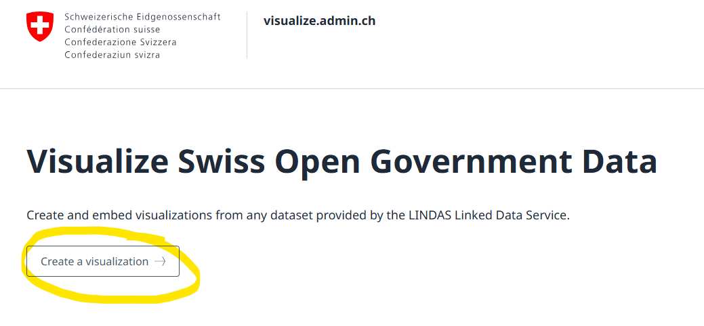

# Visualization

## Using visualize.admin.ch
The data in "cube-form" can be visualized using [visualize.admin.ch](https://visualize.admin.ch).
Visualize can read the cube data and offers editors to create all sorts of diagrams, such as tables, bar charts, scatter plots, pie charts, etc.

## How to use visualize.admin.ch
### Start
Go to [visualize.admin.ch](https://visualize.admin.ch).
Users that are logged-in can save their visualizations for further editing later on. 

Start the process by selecting "Start a visualization".

### Select Data Set
Search for your data set and select it.

### Verify Data
Verify the selected data and confirm the selection.

### Define Visualization
In this step, the actual visualization can be customized and diagram types can be chosen.

### Share or Embed the Visualization
The visualization can be shared or embedded using iFrames.

